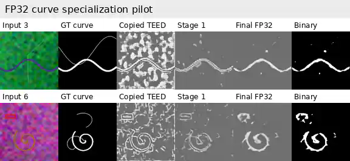
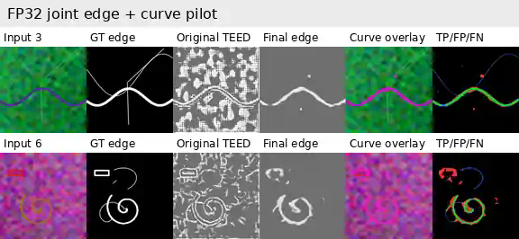

# FP32 pilot results

This directory contains a **CPU FP32 pilot**, initialized from the uploaded original TEED checkpoint `7_model.pth`.

It is not the final full BIPED + BSDS500 + CurveML training run. The pilot validates checkpoint loading, Stage 1 freezing, joint training, low-LR fine-tuning, inference, and comparison-sheet generation.

## Checkpoint verification

- Uploaded TEED checkpoint SHA256: `d0109e7f40e7d9f1f495d34947eb08167e8fbb0a13b4e6ab3121261fb8d5a416`
- TEED tensors loaded: `36 / 36`
- TEED parameters loaded: `58,910`
- TEED-Curves parameters: `67,980`
- Stage 1 trainable curve parameters: `9,070`
- Final FP32 pilot SHA256: `132ff6716fdacbc5845d575d5e025e8ef46ec608a823d16f3d341be93941762c`
- Final FP32 pilot size: `292,733 bytes`

## Pilot schedule

- Stage 1: 60 curve-only steps at 64×64, TEED encoder and edge branch frozen.
- Stage 2: 80 joint edge/curve steps at 64×64.
- Stage 3: 40 naturalized-texture steps at low learning rate.
- Evaluation: 12 fixed, held-out procedural scenes with threshold sweep.

## Held-out results

| Checkpoint | Curve F1 | Curve threshold | Edge F1 | Edge threshold |
|---|---:|---:|---:|---:|
| Original TEED + copied curve head | 0.3330 | 0.45 | 0.4274 | 0.45 |
| Stage 1 | 0.4279 | 0.50 | 0.4274 | 0.45 |
| Stage 2 | **0.5526** | 0.65 | 0.6590 | 0.65 |
| Stage 3 FP32 | 0.5503 | 0.65 | **0.6601** | 0.60 |

Stage 1 improved curve selectivity while leaving the frozen edge branch unchanged. Stage 2 produced the strongest curve F1. Stage 3 slightly traded recall for precision while retaining the best edge F1.

## Comparison sheets

The full-resolution PNG sheets and binary FP32 checkpoint were generated in the execution workspace. `fp32_pilot_metrics.json` contains the exact reported values.
