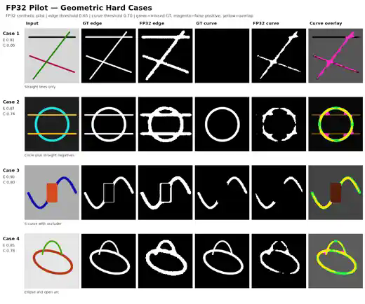
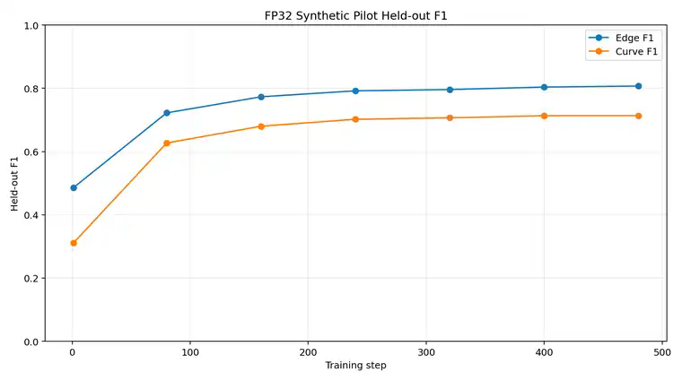

# FP32 synthetic pilot — 2026-07-24

> **Pilot, not final release weights.** Network access was unavailable in the execution container, so this model was trained from scratch using the repository's procedural synthetic composites at 128×128. It did **not** use the public TEED initializer, CurveML, BIPED, or BSDS500.

## Recommended pilot

`teed_curves_fp32_pilot.safetensors`

- 67,980 parameters; FP32; 277,952 bytes.
- 96-composite validation: edge F1 **0.8071**, curve F1 **0.7136**.
- Selected thresholds: edge **0.65**, curve **0.70**.
- Safetensors and PT state parity: exact (`0.0` maximum absolute difference).
- CPU batch-1 inference in the execution container: **18.0 ms at 128²**, **80.7 ms at 352²**.
- SHA256: `1be091b5ee4aeb68091fb5d747133eacd6a48100dc82ba5f96265f0260afc0c8`.

The binary FP32 model is provided with the accompanying run artifacts rather than committed to this repository directory.

## Experimental straight-negative fine-tune

The v2 curve-head fine-tune reduces straight-only false-positive pixels on its validation set from **5.10%** to **3.34%**, but lowers curve recall and performs worse on several thin or simple curves. It is included in the report as an ablation, not the recommended pilot.

## Comparison sheets

An additional full comparison sheet is available at `../fp32_pilot_20260724/fp32_curve_compare.svg`.

See `FP32_PILOT_REPORT.json` for checksums, aggregate measurements, runtime data, and the full limitations statement.
